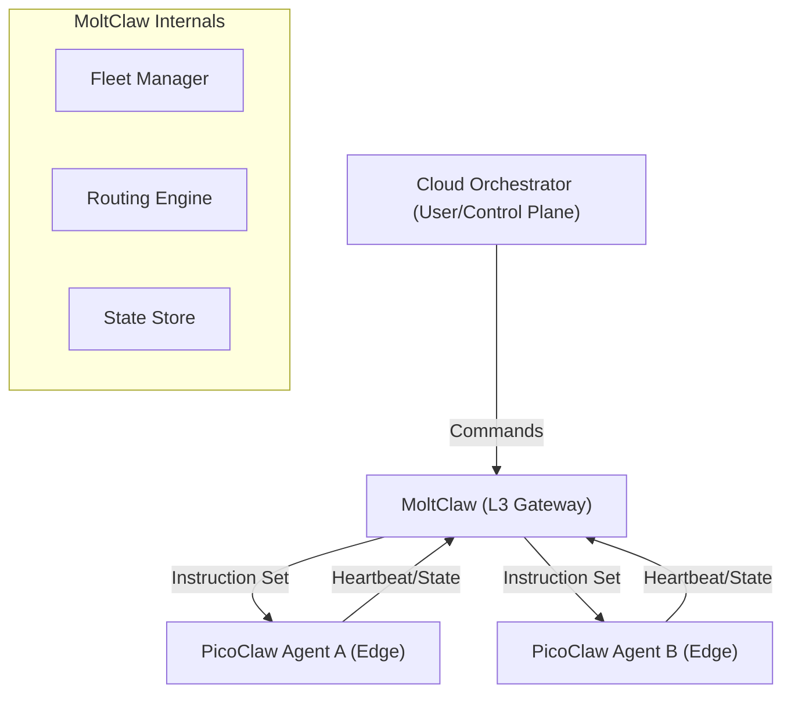

# MoltClaw Architecture

MoltClaw acts as the **L3 Cloud Gateway** for the Clawland network. Its main job is to sit between the high-level cloud orchestration and the tiny edge agents (PicoClaw) running on actual hardware.

## Big Picture

We're building this to be the "brain" that knows where every edge agent is and what it's doing. It handles the heavy lifting so the PicoClaw agents can stay lean.

## Core Components

1.  **Fleet Manager**: Keeps track of who's online. It handles the registration handshake and monitors those incoming heartbeats.
2.  **Routing Engine**: Decides which agent gets which task. If Agent A is busy or offline, the router finds someone else.
3.  **State Store**: (Coming Soon) A persistent way to remember agent configurations and history.

## Integration with PicoClaw

PicoClaw agents are expected to:
- Register themselves on startup.
- Send a "pulse" (heartbeat) every few seconds.
- Listen for specific task payloads defined in the MoltClaw instruction set.

*Note: We're still early in the design, so expect some of the internal routing logic to change as we scale. TODO: add more detail on the state store once we pick a DB.*
